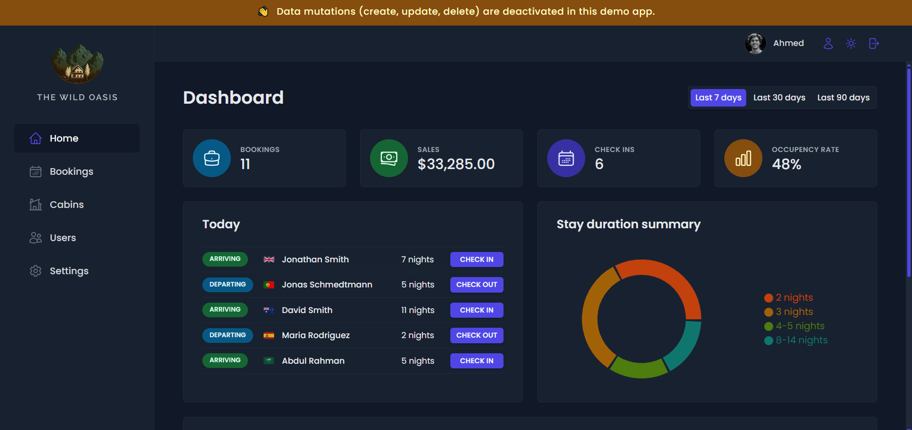

# 🌲 The Wild Oasis

A professional, internal hotel management dashboard built for boutique hotel staff. This application allows users to manage cabins, bookings, and guests, as well as view real-time statistics and visualizations.

 


## 🔗 Live Demo

**[Click here to visit the Live App](https://the-wild-oasis-red-rho.vercel.app)**

### 🔑 Demo Credentials
To explore the dashboard without setting up a local environment, use these credentials:

*   **Email:** `user@demo.com`
*   **Password:** `password123`

_Note: The application is in "Demo Mode". Data mutations (Create, Update, Delete) are disabled for this user to maintain data integrity._

---

## ✨ Key Features

*   **📊 Real-time Dashboard:** Visualizes booking statistics, sales, and occupancy rates using **Recharts**.
*   **📅 Booking Management:** Check-in/Check-out functionality, status management, and guest details.
*   **🏠 Cabin Management:** List, sort, and filter luxury cabins (CRUD operations secured by RLS).
*   **🌙 Dark Mode:** Fully responsive dark/light mode toggle using CSS variables and Context API.
*   **🔐 Authentication:** Secure login using **Supabase Auth**.
*   **🛡️ Security:** Implementation of **Row Level Security (RLS)** in Supabase to protect data.
*   **🔄 Evergreen Data:** A scheduled **GitHub Action** resets the database daily, ensuring the dashboard always shows relevant data relative to the current date (no "stale" data from months ago).

## 🛠️ Tech Stack

*   **Frontend:** React.js, Vite
*   **State Management:** React Query (TanStack Query), Context API
*   **Styling:** Styled Components
*   **Forms:** React Hook Form
*   **Backend / DB:** Supabase (PostgreSQL, Auth, Storage, Edge Functions)
*   **Icons/Charts:** React Icons, Recharts

## 💻 Running Locally

1.  **Clone the repository**
    ```bash
    git clone https://github.com/Amr-Kilany/the-wild-oasis.git
    cd the-wild-oasis
    ```

2.  **Install dependencies**
    ```bash
    npm install
    ```

3.  **Set up Environment Variables**
    Create a `.env` file in the root directory and add your Supabase credentials:
    ```env
    VITE_SUPABASE_URL=your_supabase_url
    VITE_SUPABASE_KEY=your_supabase_anon_key
    ```

4.  **Run the app**
    ```bash
    npm run dev
    ```

## 🤖 Automations

This project includes a **GitHub Actions** workflow (`.github/workflows/cron.yml`).
Every day at midnight, a script (`scripts/seed.js`) runs to:
1.  Wipe the modified data.
2.  Re-upload sample bookings.
3.  Recalculate dates so that check-ins always appear for "Today".

This ensures that whenever a recruiter visits the site, the dashboard looks active and alive.

---

**Developed by Amr Kilany**